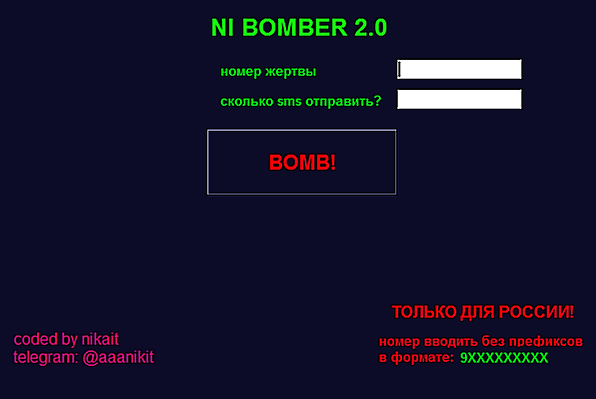

Это desktop версия бомбера https://github.com/Nikait/ni_bomber 
Сделано под Windows и Linux на python tkinter

#  Установка
## Windows
Если у вас Windows 7 x86 или x64 то скачивайте уже готовый gui_bomber.exe
Затем создайте ярлык exe файла и переместите его на рабочий стол.
Запускайте. Действует только по русским номерам. 
Когда вы запустите прогу, всё заполните и нажмёте BOMB, 
скорее всего она зависнет, всё нормально, sms отправляются!

Если у вас другая версия Windows, то скачайте файл gui_bomber.py
Даллее компилируете командой: pyinstaller -w -F gui_bomber.py
Для этого установите все зависимости, в том числе и pyinstaller
готовый exe у вас будет лежать в папке dist

## Linux
1) клонируете репозиторий git clone https://github.com/Nikait/ni_GuiBomber
2) cd ni_GuiBomber
3) pip install -r requirements.txt 
   устанавливаете все зависимости для python 3.6 и более
4) python3 gui_bomber.py

#  Donate
донаты на чашку кофе:

    monero: 
    48TmwHGVsqSKgD7giTALoK7P2muKLTJn5R8s5XtKZL1jEr4MJFBAwczVtofuFGvzsT1CzTcFXotwZCDno1UsskqFFZe9wVC
***
    bitcoin:
    18LKUKWAUBAFKzLBdFFkt687vh8rMPhL1u
